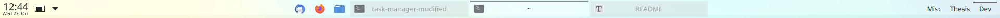

# Task Manager Modified

This is a modification of KDE’s [task manager applet](https://github.com/KDE/plasma-desktop/tree/master/applets/taskmanager) with a bunch of dirty hacks to:

- make the indicators in the task bar visually more minimal and look like tabs (no background color, no indicator except for active tab, invert indicator position)
- make it properly centrable (the original has some protruding space causing the visible entries to be shifted off-center)
- strip the labels down to bare file names (remove application names and file endings)
- center the labels in the entry and elide (…) long labels in the middle instead of the end
- add more window controls in the tool tip
- restore the behavior of previous versions where hovering an entry shows a semi-translucent full-screen preview of the window, and remove the small thumbnails
- abuse the “switch to x-th window” function to enable cycling windows in the order in which they appear in the task bar
- and possibly some other small cosmetic changes I forgot to list.

You can diff my fork against the [main branch](https://github.com/KDE/plasma-desktop/tree/master/applets/taskmanager) and cherry-pick your own combination with the changes you’d like to have.



## Installation

### Applet

1. Download: GitHub repo > green top right button *Code* > *Download ZIP* > unpack and extract the `task-manager-modified` folder

2. Install the package: Open a terminal in the `task-manager-modified` folder and run 

   ````bash
   kpackagetool5 -t Plasma/Applet --install package
   ````

   (of if you made changes after already having installed it, use the `–-upgrade` option instead)

3. Restart Plasma:

   ````
   plasmashell --replace &&
   ````

4. Add the modified version to your panel: right-click on panel > *Edit panel* > *Add widgets …* > select *Task Manager Classic Modified*

### Style

1. Find your currently used theme (e.g. `breeze-light`) in either `~/.local/share/plasma/desktoptheme/` or `/usr/share/plasma/desktoptheme/` and create a copy in `~/.local/share/plasma/desktoptheme/`
2. Give the theme a new name: as the folder name, in `metadata.desktop`: `Name` and in `metadata.desktop`: `X-KDE-PluginInfo-Name`
3. Replace `widgets/tasks.svgz` with the `tasks.svgz` from this repository
4. Apply the theme via system settings

